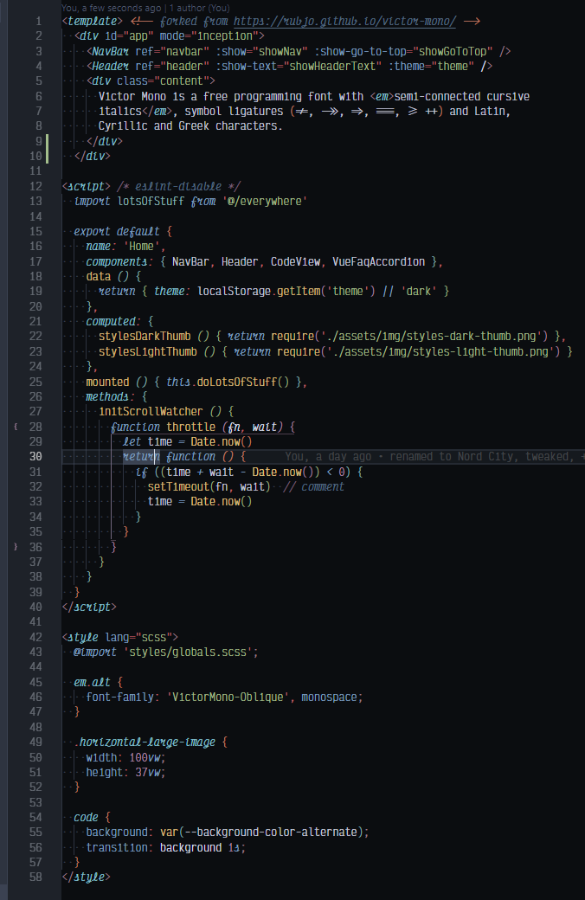

<div align="center">

# Nord City VSCode Theme


A customized Nord theme for Visual Studio Code with italic support and wider range of colors used.  Intended to work with [Victor Mono](https://rubjo.github.io/victor-mono/) programming font, but should work with [Operator Mono ($297USD)](https://www.typography.com/fonts/operator/styles/operatormono0), & other [italic alternatives](https://dev.to/jandedobbeleer/a-viable-alternative-to-operator-mono-in-visual-studio-code-ge8).  A no italic option is available.



For more screenshots for PHP, Markdown, VLang, etc, visit the [demos page](https://github.com/tomByrer/nord-city-theme/demos/demos.md).

</div>

## Installation

1. Open the **Extensions** sidebar in VSCode. `View → Extensions`
2. Search for and choose `Nord City Theme` by Tom Byrer / `tomByrer`
4. Click **Reload** to reload your editor
5. Navigate to File > Preferences > Color Theme > **Nord City Theme** or any of the variants listed
6. Check out your projects with Nord City 🎉🎉.

### Optional Plugins

Screenshots use [Victor Mono font](https://rubjo.github.io/victor-mono/#get_it) with ligatures turned on & [CoenraadS/Bracket-Pair-Colorizer-2](https://marketplace.visualstudio.com/items?itemName=CoenraadS.bracket-pair-colorizer-2).   Note: there is a bug in BPC2 that [highlights HTML comment brackets](https://github.com/CoenraadS/Bracket-Pair-Colorizer-2/issues/114).  This configuration works well on my smaller 4k monitor.

#### optional `setings.json`


```json
    "breadcrumbs.enabled": true,
    "window.zoomLevel": 0,
    "editor.fontFamily": "'Operator Mono', 'Victor Mono', 'Fira Code', Consolas, 'Courier New', monospace",
    "editor.fontLigatures": true,
    "editor.fontWeight": "300",
    "editor.letterSpacing": 0.3,
    "editor.fontSize": 14.5,
    "bracket-pair-colorizer-2.colors": [
        "#d08770e8",
        "#8fbcbbe8",
        "#a3be8ce8",
        "#b48eade8"
    ],
    "bracket-pair-colorizer-2.showBracketsInGutter": true,
    "editor.renderWhitespace": "boundary",
    ...etc
```

## Author

Hacked by **[Tom Byrer](https://github.com/tomByrer)** in Kansas City.
Follow me on **[Twitter](https://twitter.com/tomByrer)**

See [CHANGELOG.md](CHANGELOG.md) for history & prior authors' credits.

