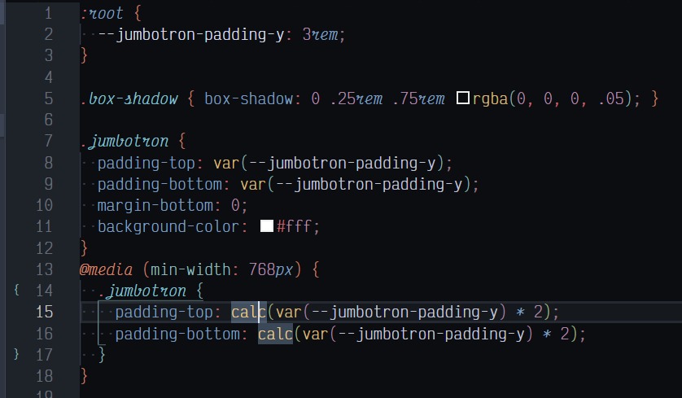

# Nord City Theme Demos

[My VSCode configuration](../README.md#optional_plugins) is likely different than yours, so some things like the bracket colors will be more plain.

## CSS

SCSS is the same.

## JSON

JSON seems a bit dark & too woodsy for me, but does match how strings are quoted, so I'll leave for now..

## JSX (XML inside JavaScript)

Compare to the [origninal Nord Visual Studio Code](https://www.nordtheme.com/ports/visual-studio-code) screenshot.

## Markdown

I tweaked the Markdown theme as much as the JS/JSX; I wanted the base text to flow well, while highlighting the control characters and headings.  That's why the link-text is barely different from the rest of the prose.

## PHP

I might have to use PHP more to adjust the colors; seems a bit too colorful for me.  But I don't really use PHP at this time (2019-10).  Did you know [WordPress runs on ~35% of public websites](https://w3techs.com/technologies/details/cm-wordpress/all/all)?!?  That's marketshare!

## VLang

["V"](https://vlang.io/) is a new (started Summer of 2019) programming language that transpiles into C & soon JavaScript.  The theme for Vlang doesn't seem that colorful, but there aren't that many keywords anyhow.
